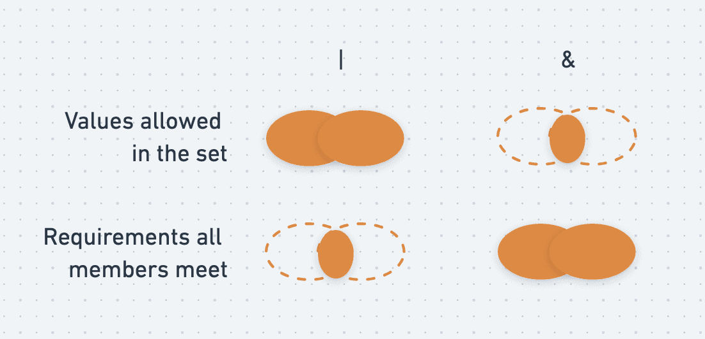

### Union and Intersection types
- Intersection and Union types are one of the ways in which you can compose types.
- Union and intersection types can conceptually be thought of as logical boolean operators (AND, OR) as they pertain to types.
- An intersection type combines multiple types into one. This allows you to add together existing types to get a single type that has all the features you need. For example, Person & Serializable & Loggable is a type which is all of Person and Serializable and Loggable. That means an object of this type will have all members of all three types.

See Examples in [unionAndIntersectionType.ts](./src/unionAndIntersectionTypes.ts)

#### Discriminating Unions

> In computer science, a tagged union, also called a variant, variant record, choice type, discriminated union, disjoint union, sum type, or coproduct, is a data structure used to hold a value that could take on several different, but fixed, types. Only one of the types can be in use at any one time, and a tag field explicitly indicates which type is in use. - [Wikipedia](https://en.wikipedia.org/wiki/Tagged_union)

See Examples in [discriminatingUnions.ts](./src/discriminatingUnions.ts)

#### Union Exhaustiveness checking
- We would like the compiler to tell us when we don’t cover all variants of the discriminated union.
- There are two ways to do this. The first is to turn on [strictNullChecks](https://www.typescriptlang.org/tsconfig#strictNullChecks) and specify a return type
- The second method uses the never type that the compiler uses to check for exhaustiveness

See Examples in [exhaustiveness.ts](./src/exhaustiveness.ts)

#### Reference
- [TS Handbook - Union and Intersection Types](https://www.typescriptlang.org/docs/handbook/unions-and-intersections.html)
- [TS Training - Union and Intersection Types](https://www.typescript-training.com/course/fundamentals-v4/06-union-and-intersection-types/)
- [freeCodeCamp.org - Learn TypeScript – Full Tutorial](https://www.youtube.com/watch?v=30LWjhZzg50&t=6603s)